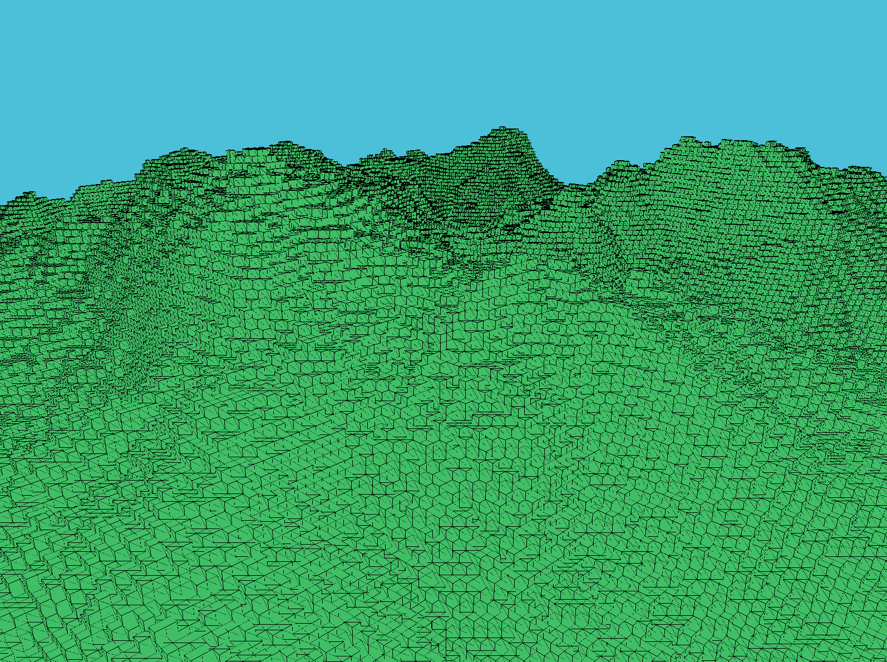

# chunk-generator

A lightweight voxel rendering engine written in C++ using OpenGL, featuring procedural terrain generation with Perlin Noise based heightmaps.

## Features
- **Chunk-based voxel world** for efficient rendering and memory use.
- **Procedural terrain** generated via 2D Perlin noise for realistic heightmaps.
- **Configurable noise parameters** (frequency, amplitude) to control terrain scale.
- **Optimized mesh building** using face culling for hidden blocks.
- **Simple camera controls** for exploring the generated terrain.

## Controls
- WASD : Move camera
- Mouse : Look around
-ESC : Exit application

## Fun Configs
- Try changing the seed!
- Adjust the frequency and amplitude (chunk.h)!
- Adjust the chunk size (chunk.h)!
- Render more chunks (main.cpp)!

## Dependencies
- C++17 or newer
- OpenGL 3.3+
- [GLFW](https://www.glfw.org/) (window/context management)
- [GLAD](https://glad.dav1d.de/) (OpenGL function loader)
- [GLM](https://github.com/g-truc/glm) (math library)

## Credits
    Camera system and shader class adapted from LearnOpenGL by Joey de Vries.